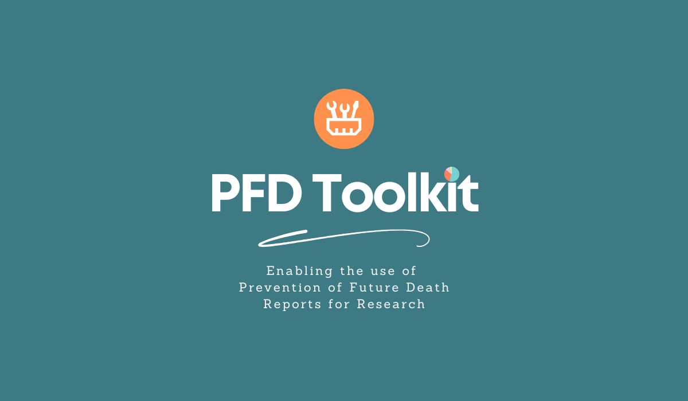

# PFD-toolkit

A Python toolkit for using cleaned **Prevention of Future Death (PFD) reports** from the UK Judiciary website.

## Features

- Load ready-to-use and fully-cleaned PFD report datasets - all updated once a week.
- Query reports to find matches for your specific research questions.
- Create custom categorisation systems for tailored data curation.
- Generate concise summaries of reports.
- Call a web scraper for custom data collection.


## Installation

IMPORTANT: the package is not yet live and the below instructions will not work.

```bash
pip install pfd-toolkit
```

If you need .docx -> .pdf conversion, install with

```bash
pip install pfd-toolkit[docx-conversion]
```

## Getting started


### Download PFD Report Data

We scrape and clean PFD reports so you don't have to. Each week (at Monday 00:00), we update our collection of cleaned & processed PFD reports so that the collection stays up-to-date.

To load data, run:

```python
from pfd-scraper import Downloader

downloader = Downloader(
    category='all' # See 'category' section for more
    dates={"2020-01-01", "2025-01-01"}, # Start and end dates for reports
    clean=True
)

reports = downloader.load_reports()
```

`reports` will be a pandas dataframe with your PFD report data.


### Categorise / group the data

The current problem with analysing PFDs for specific research questions is that it takes far too long to read through each report and manually 'tag' them as you go along. PFD Toolkit handles this for you:

```python
from pfd-toolkit import Sorter

# Define a dictionary to sort PFD reports by
# ..."Theme 1": ["Guidence note 1", "Guidance note 2"]
# ...etc

description = "All reports that are concerned with deaths in NHS settings."

NHS_death_themes = {
    "Diagnosis Failures": ["Missed cancer", "Late sepsis recognition"],
    "Treatment Errors": ["Wrong medication", "Surgical complications"],
    "Staffing & Resources": ["Understaffing", "Overworked clinicians"],
    "Communication Failures": ["Missed test results", "Handoff errors"],
    "Patient Safety": ["Falls", "Hospital-acquired infections"],
    "Emergency & Critical Care": ["Ambulance delays", "A&E overcrowding"]
}

sorter = Sorter(
    description = description, # Supply our description of the task.
    themes = NHS_death_themes, # Supply our dictionary
    exhaustive = False # Whether guidance notes are exhaustive/illustrative
)

sorted = sorter.group_reports(reports) # Supply original dataframe containing reports
```

### Clean the data

By default, PFD downloaded report data will be cleaned and preprocessed ready for you to use. However, if you want to use your own custom cleaning configurations, you can run:

```python
from pfd-scraper import Cleaner

cleaner = Cleaner(
    correct_spelling=True,
    anonymise=False,
    # [other arguments]
)

reports_cleaned = cleaner.clean_reports(reports)
```

### Scrape the reports for yourself

We expect most users to simply download the data using Downloader. However, you are free to scrape the data yourself if you wish:


```python
from pfd-scraper import PFDScraper

scraper = PFDScraper(
    category='all', # The category from the judiciary website
    dates={"2020-01-01", "2025-01-01"} # Start and end dates
    llm_fallback=True, # If True, an LLM will attempt to fix any missing data
    openai_api = "[your-openai-api-key]", # See API section for more
)
reports = scraper.scrape_reports()
```

Suppose you want to update your dataframe with newly published reports. PFD Toolkit lets you 'top up' your dataset with these reports.

```python
reports_topped_up = scraper.top_up(reports, dates={
    "2025-01-01", "2026-01-01"})

```
## Licence

This project is licensed under the terms of the MIT Licence. For more information, see `LICENCE`.

