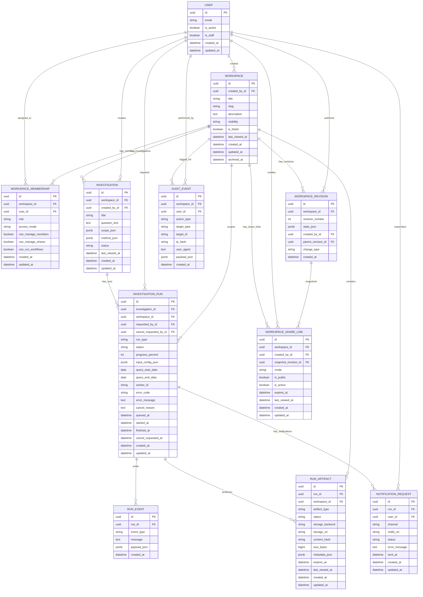

# PFD Toolkit Workbench v0.2 Data Model

Status: Draft for implementation
Owner: v0.2 rewrite
Last updated: 2026-04-19

## 1. Purpose

This document defines the proposed relational-plus-JSON (hybrid) data model for Workbench v0.2.

It is designed to support:

- account-based access
- team/shared workspaces with per-user read-only vs editable access
- private and public workspace visibility
- async workflow execution that continues server-side if users leave
- run cancellation and durable run status tracking
- revision history for restore/undo/redo style behavior
- audit logging
- inactivity-based expiration after one year without views

## 2. Design Decisions Captured

1. Hybrid model: normalize core entities, keep flexible config in JSON fields.
2. Workspace editability is per user-workspace relation, not global on workspace.
3. Public workspace visibility can be no-login view access.
4. Share links default to `snapshot` mode; `live` mode is supported.
5. API keys are stored server-side only as encrypted workspace-scoped credentials.
6. Async runs are first-class domain objects with cancellation.
7. Expiration uses sliding inactivity windows, not fixed-from-creation TTL.

## 3. Entity Definitions

## 3.1 User

Backed by Django auth user model (customizable later).

Primary purpose:

- identity
- ownership
- membership
- run requester attribution

## 3.2 Workspace

Top-level collaboration container.

Key fields:

- `id` (UUID, PK)
- `title` (string)
- `slug` (string)
- `description` (text)
- `created_by_id` (FK -> User)
- `visibility` (`private` or `public`)
- `is_listed` (bool)
- `last_viewed_at` (datetime, nullable)
- `created_at` (datetime)
- `updated_at` (datetime)
- `archived_at` (datetime, nullable)

## 3.3 WorkspaceMembership

Per-user access policy for a workspace.

Key fields:

- `id` (UUID, PK)
- `workspace_id` (FK -> Workspace)
- `user_id` (FK -> User)
- `role` (`owner`, `editor`, `viewer`)
- `access_mode` (`edit`, `read_only`)
- `can_manage_members` (bool)
- `can_manage_shares` (bool)
- `can_run_workflows` (bool)
- `created_at` (datetime)
- `updated_at` (datetime)

Constraints:

- unique `(workspace_id, user_id)`
- at least one owner per workspace (service-layer invariant, optionally DB-supported)

## 3.4 WorkspaceRevision

Immutable snapshots of workspace state/config.

Key fields:

- `id` (UUID, PK)
- `workspace_id` (FK -> Workspace)
- `revision_number` (int, monotonic per workspace)
- `state_json` (JSONB)
- `created_by_id` (FK -> User, nullable for system events)
- `change_type` (`edit`, `undo`, `redo`, `restore`, `system`)
- `parent_revision_id` (FK -> WorkspaceRevision, nullable)
- `created_at` (datetime)

Constraint:

- unique `(workspace_id, revision_number)`

Notes:

- Undo/redo should be implemented as restore-to-previous-state actions that create new immutable revisions.

## 3.5 Investigation

User-defined analysis configuration living under a workspace.

Key fields:

- `id` (UUID, PK)
- `workspace_id` (FK -> Workspace)
- `title` (string)
- `question_text` (text)
- `scope_json` (JSONB)
- `method_json` (JSONB)
- `status` (`draft`, `active`, `archived`)
- `created_by_id` (FK -> User)
- `last_viewed_at` (datetime, nullable)
- `created_at` (datetime)
- `updated_at` (datetime)

## 3.6 InvestigationRun

Server-side async run record for workflows.

Key fields:

- `id` (UUID, PK)
- `investigation_id` (FK -> Investigation)
- `workspace_id` (FK -> Workspace, denormalized for querying)
- `run_type` (`filter`, `themes`, `extract`, `export`)
- `status` (`queued`, `starting`, `running`, `cancelling`, `cancelled`, `succeeded`, `failed`, `timed_out`)
- `progress_percent` (int, nullable)
- `queued_at` (datetime)
- `started_at` (datetime, nullable)
- `finished_at` (datetime, nullable)
- `requested_by_id` (FK -> User)
- `cancel_requested_at` (datetime, nullable)
- `cancel_requested_by_id` (FK -> User, nullable)
- `cancel_reason` (text, nullable)
- `worker_id` (string, nullable)
- `error_code` (string, nullable)
- `error_message` (text, nullable)
- `input_config_json` (JSONB)
- `query_start_date` (date, nullable)
- `query_end_date` (date, nullable)
- `created_at` (datetime)
- `updated_at` (datetime)

Behavior:

- Run continues server-side even if requester closes browser.
- Cancellation is cooperative: status transitions to `cancelling` then terminal state.

## 3.7 RunEvent

Detailed event stream for run progress and diagnostics.

Key fields:

- `id` (UUID, PK)
- `run_id` (FK -> InvestigationRun)
- `event_type` (`stage`, `progress`, `warning`, `error`, `info`, `cancel_check`)
- `message` (text)
- `payload_json` (JSONB)
- `created_at` (datetime)

## 3.8 RunArtifact

Persistent output objects created by runs.

Key fields:

- `id` (UUID, PK)
- `run_id` (FK -> InvestigationRun)
- `workspace_id` (FK -> Workspace)
- `artifact_type` (`filtered_dataset`, `theme_summary`, `theme_assignments`, `extraction_table`, `bundle_export`, `preview`)
- `status` (`pending`, `building`, `ready`, `failed`, `expired`)
- `storage_backend` (`db`, `object_storage`, `file`)
- `storage_uri` (string, nullable)
- `content_hash` (string, nullable)
- `size_bytes` (bigint, nullable)
- `metadata_json` (JSONB)
- `expires_at` (datetime, nullable)
- `last_viewed_at` (datetime, nullable)
- `created_at` (datetime)
- `updated_at` (datetime)

## 3.9 WorkspaceShareLink

Share endpoint and mode control.

Key fields:

- `id` (UUID token, PK)
- `workspace_id` (FK -> Workspace)
- `created_by_id` (FK -> User)
- `mode` (`snapshot`, `live`)
- `snapshot_revision_id` (FK -> WorkspaceRevision, nullable)
- `is_public` (bool)
- `is_active` (bool)
- `expires_at` (datetime, nullable)
- `last_viewed_at` (datetime, nullable)
- `created_at` (datetime)
- `updated_at` (datetime)

Defaults:

- mode defaults to `snapshot`

Notes:

- Live mode is enabled and uses encrypted workspace credentials for server-side async execution.

## 3.10 AuditEvent

Cross-domain immutable audit log.

Key fields:

- `id` (UUID, PK)
- `workspace_id` (FK -> Workspace, nullable)
- `user_id` (FK -> User, nullable for guest/system)
- `action_type` (string)
- `target_type` (string)
- `target_id` (string/UUID as text)
- `ip_hash` (string, nullable)
- `user_agent` (text, nullable)
- `payload_json` (JSONB)
- `created_at` (datetime)

## 3.11 NotificationRequest

Deferred delivery request record for run completion notifications.

Key fields:

- `id` (UUID, PK)
- `run_id` (FK -> InvestigationRun)
- `user_id` (FK -> User)
- `channel` (`email`)
- `notify_on` (`success`, `failure`, `any`)
- `status` (`pending`, `sent`, `failed`, `cancelled`)
- `sent_at` (datetime, nullable)
- `error_message` (text, nullable)
- `created_at` (datetime)
- `updated_at` (datetime)

## 4. Permission Model Summary

Workspace visibility:

- `private`: only assigned users can view
- `public`: viewable without login

Membership controls:

- role controls responsibility level
- `access_mode` controls editability for that specific user
- owner can toggle read-only/edit for themselves and others

## 5. Inactivity and Expiration Policy

Policy target:

- one year inactivity expiration window
- any view qualifies as activity, including guest views for public links/workspaces

Operational model:

1. Update `last_viewed_at` on workspace/share/artifact views.
2. Scheduled cleanup checks inactivity age.
3. Mark stale artifacts as `expired`.
4. Optionally archive stale workspaces based on business rules.

## 6. Async Run Lifecycle

Expected transitions:

- `queued -> starting -> running -> succeeded`
- `queued|starting|running -> cancelling -> cancelled`
- `starting|running -> failed`
- `starting|running -> timed_out`

All terminal transitions should emit `RunEvent` and `AuditEvent`.

## 7. Mermaid ER Diagram

## 8. Implementation Notes for Django

1. Use UUID PKs for external-facing models.
2. Use `models.JSONField` for JSONB-compatible fields.
3. Add explicit `db_index=True` to status, foreign keys, and activity timestamps used by cleanup jobs.
4. Enforce uniqueness and core invariants in both DB constraints and service-layer checks.
5. Keep run status transitions in a dedicated service to avoid invalid state changes.
6. Track activity timestamps in one place (view middleware or service helper) for consistency.

## 9. Open Items Pinned for Later

1. Credential encryption key-rotation runbook and backward-compatibility migration plan.
2. Full compliance policy (GDPR deletion/export obligations).
3. Notification channel expansion beyond email.
4. Public workspace discovery and listing policy moderation.
