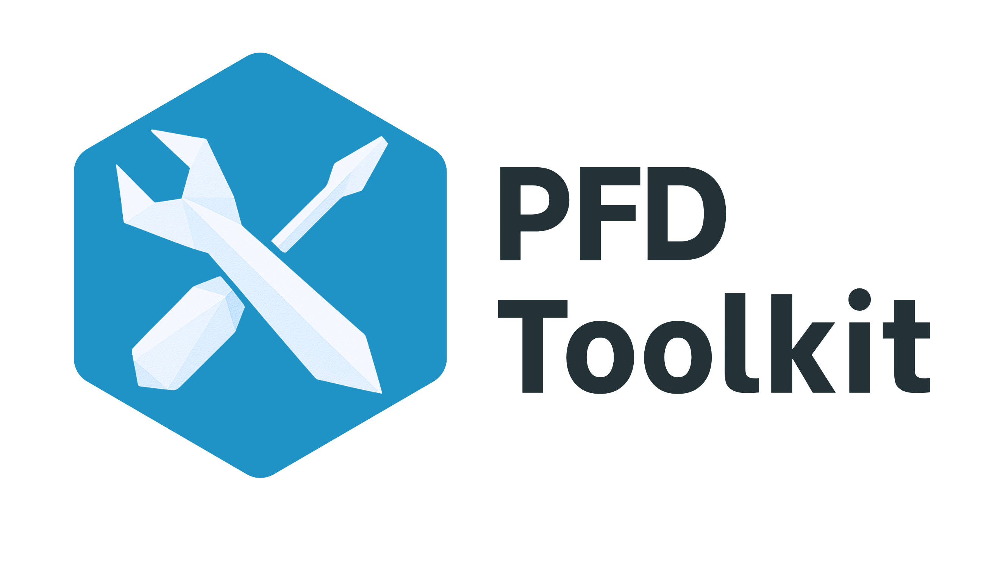

---

## Background

*PFD Toolkit* is an open-source Python package created to transform how researchers, policymakers, and analysts accessed and analysed Prevention of Future Death (PFD) reports from coroners in England and Wales.

### The problem

PFD reports have long served as urgent public warnings — issued when coroners identified risks that could, if ignored, lead to further deaths. Yet despite being freely available, these reports were chronically underused. This was for one simple reason: they were a *nightmare* to work with. Common issues included:

 * No straightforward way to download reports in bulk

 * Wildly inconsistent formats, making traditional web scraping unreliable

 * No system for surfacing recurring themes

 * Widespread miscategorisation of reports, creating research limitations

 * No easy way for users to screen reports for cases relevant to their research

As a result, valuable insights often ended up buried beneath months or even years of manual admin. Researchers were forced to sift through thousands of reports one by one, wrestle with patchy metadata, and code themes by hand. 


### Our solution

PFD Toolkit acts as a one-stop-shop for extracting, screening and analysing PFD report data.

The package brings together every PFD report and made them available in a single, downloadable dataset, ready for instant analysis. This dataset looks like this:

| url                                   | id         | date       | coroner      | area                           | receiver                  | investigation           | circumstances       | concerns         |
|----------------------------------------|------------|------------|------------------|--------------------------------|---------------------------|-----------------------------------|----------------------------|--------------------------|
| https://www.judiciary.uk/prevention...<br> | 2025-0207 | 2025-04-30 | Alison Mutch     | Manchester South               | Flixton Road...        | On 1st October...                 | Louise Danielle...         | During the course...     |
| https://www.judiciary.uk/prevention...<br> | 2025-0208 | 2025-04-30 | Joanne Andrews   | West Sussex...       | West Sussex County...     | On 02 November...                 | Mrs Turner drove...        | During the course...     |
| https://www.judiciary.uk/prevention...<br> | 2025-0120 | 2025-04-25 | Mary Hassell     | Inner North London             | The President...       | On 23 August...                   | Jan was a big baby...      | During the course...     |
| https://www.judiciary.uk/prevention...<br> | 2025-0206 | 2025-04-25 | Jonathan Heath   | North Yorkshire and York       | Townhead Surgery          | On 04 June...                     | On 15 March 2024...        | During the course...     |
| https://www.judiciary.uk/prevention...<br> | 2025-0199 | 2025-04-24 | Samantha Goward  | Norfolk                        | The Department...         | On 22 August...                   | In summary, on...          | During the course...     |


> As of the latest update, PFD Toolkit includes **5720** PFD reports.


---
PFD Toolkit was built to break down every major barrier to PFD report analysis. Out of the box, you can:

1. Load live PFD data in seconds

2. Query and filter reports with natural language

3. Summarise reports to highlight key messages

4. Automatically discover recurring themes

5. Tag and organise reports based on these themes (or provide your own themes!)


Data is updated once a week, with newly published reports added to the toolkit.


---

## Installation

You can install PFD Toolkit using pip:

```bash
pip install pfd_toolkit
```

---

## Contribute

PFD Toolkit is designed as a research-enabling tool, and we’re keen to work with the community to make sure it genuinely meets your needs. If you have feedback, ideas, or want to get involved, head to our [Feedback & contributions](contribute.md) page.