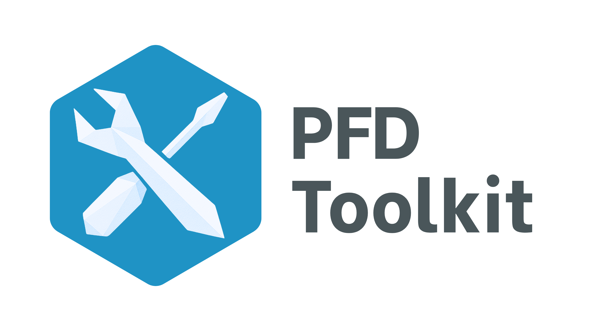

*Lead Developer: Sam Osian*

*Contributor: John Pytches*

---

## Background

**PFD Toolkit** is an open-source Python package built to transform the way researchers, policymakers, and analysts access and analyse Prevention of Future Death (PFD) reports from coroners in England and Wales.

### The problem

PFD reports are vital public documents that highlight risks and drive changes to help prevent future fatalities. Yet, they remain significantly underused — largely because they are difficult to work with in practice. Barriers include:

- There being no easy way to download reports in bulk

- Inconsistent formatting that makes traditional web scraping unreliable

- No system for tracking recurring or emerging themes

- Widespread miscategorisation of reports, making analysis cumbersome

- No way for users to easily screen reports to identify cases relevant to their research


As a result, analysing PFD reports has previously been a slow, manual process — taking months or even years to complete. 

### Our solution

We've collected all PFD reports, and made them available in a single, downloadable dataset that looks like this:

| URL                                   | ID         | Date       | CoronerName      | Area                           | Receiver                  | InvestigationAndInquest           | CircumstancesOfDeath       | MattersOfConcern         |
|----------------------------------------|------------|------------|------------------|--------------------------------|---------------------------|-----------------------------------|----------------------------|--------------------------|
| https://www.judiciary.uk/prevention...<br> | 2025-0207 | 2025-04-30 | Alison Mutch     | Manchester South               | Flixton Road...        | On 1st October...                 | Louise Danielle...         | During the course...     |
| https://www.judiciary.uk/prevention...<br> | 2025-0208 | 2025-04-30 | Joanne Andrews   | West Sussex...       | West Sussex County...     | On 02 November...                 | Mrs Turner drove...        | During the course...     |
| https://www.judiciary.uk/prevention...<br> | 2025-0120 | 2025-04-25 | Mary Hassell     | Inner North London             | The President...       | On 23 August...                   | Jan was a big baby...      | During the course...     |
| https://www.judiciary.uk/prevention...<br> | 2025-0206 | 2025-04-25 | Jonathan Heath   | North Yorkshire and York       | Townhead Surgery          | On 04 June...                     | On 15 March 2024...        | During the course...     |
| https://www.judiciary.uk/prevention...<br> | 2025-0199 | 2025-04-24 | Samantha Goward  | Norfolk                        | The Department...         | On 22 August...                   | In summary, on...          | During the course...     |


> As of the latest update, PFD Toolkit includes **{{NUM_REPORTS}}** PFD reports.

---

## Key features

PFD Toolkit seeks to overcome barriers to analysing PFD reports. Features include:

1. Loading live PFD report data in seconds*

2. Correcting spelling, grammar, and formatting issues

3. Query and surface reports relevant to your work

4. Uncover recurring trends & themes

5. Tag and organise reports by your own themes or sub-themes


**Data are updated once a week with freshly published reports.*

---

## Installation

You can pip install PFD Toolkit like any other Python package:

```bash
pip install pfd_toolkit
```

*(Note: PFD Toolkit is not available via Anaconda)*

---

## Contribute

PFD Toolkit is a research-enabling tool, and so we want to engage with the research community as much as possible to make sure this toolkit works for you *(yes, you!)*. 

If you have any feedback, suggestions or want to help develop the toolkit please see our [Feedback & contributions](contribute.md) page.